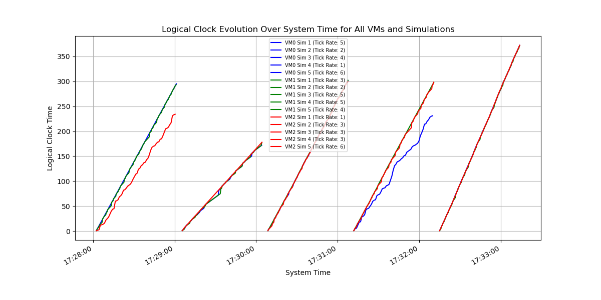

# Engineering Notebook

## Project Overview

We aimed to simulate a distributed system with multiple virtual machines (VMs) running on a single physical machine. Each VM operates at its own speed (clock rate) and communicates with other VMs through socket connections.

## Design Decisions

### 1. Processing Messages
We have two queues in our implementation:
1. Network Queue: A queue where incoming messages are initially stored when they arrive via a socket connection.
2. Message Queue: A separate queue that holds messages that are ready to be processed by the virtual machine on its logical clock cycle.
In our design, messages are first received in the network queue, which operates independently of the machine's clock cycle. The machine then moves messages from the network queue to the message queue, where they wait to be processed according to the machine’s clock rate. This separation ensures that network delays and processing delays are independent, just as in real-world distributed systems.

### 2. Assigning Different Ports for Each VM 
Each VM listens on a different port because they're all running on the same machine (i.e. 127.0.0.1 or localhost). If they used the same port, there would be a conflict since only one process can bind to a specific port at a time.
We assign each VM a unique port by adding the VM's ID to a base port number (5000). So VM 0 listens on port 5000, VM 1 on port 5001, and VM 2 on port 5002.

### 3. Each VM is Handled in a Separate Thread
Initially we thought to implement each of the VMs as a separate process but later decided to implement each VM in a separate thread for simplicity. We implemented the VirtualMachine class as a regular class and used threads to run each VM instance concurrently. This design allows VMs to execute independently while still sharing memory, making message passing easier without requiring inter-process communication.

Our implementation uses three threads to handle different aspects of each VM's operation:
1. Main Thread: Initializes the VMs and runs the main execution logic
2. Server Thread: Waits and listens for incoming messages
3. Client Handler Threads: Takes in incoming messages, and places them in the network queue
However, to ensure synchronization, only the main execution thread updates the logical clock. This prevents race conditions and ensures that logical time updates happen in a controlled manner.

### 4. Continuous Server Listening Using Non-Blocking Sockets
We decided to keep the server continuously listening for incoming messages using a dedicated thread without blocking execution. Each incoming message spawns a new thread to handle the client request, allowing multiple messages to be received in parallel. A timeout mechanism ensures that the server remains responsive and can shut down gracefully when needed.

### 5. Thread-Safe Synchronization with Locks
We use a thread lock to ensure that updates to the logical clock are atomic since multiple threads access the logical clock concurrently (main thread, message processing thread, network listener). This prevents race conditions where two threads might update the clock simultaneously, leading to inconsistencies.

### 6. Logical Clock Update Following [Lamport's algorithm](https://en.wikipedia.org/wiki/Lamport_timestamp)
Each virtual machine maintains a logical clock that is updated based on Lamport’s logical clock rules:
1. If a message is received, the logical clock is updated to `max(local_clock, received_timestamp) + 1`.
2. If an internal event occurs, the logical clock is simply incremented by 1. This ensures that event ordering is maintained in the distributed system, even if messages arrive out of order.

---------------------------------

## Communication Flow

1. Initialization:
- Each VM starts a server thread (`listen_for_messages()`) that listens on its assigned port
- Each VM knows the IDs of its peer VMs
2. Sending Messages:
- When a VM decides to send a message (based on the random event 1-3), it calls `send_message(recipient_id)`
- This method creates a socket connection to the recipient's port: `s.connect(("localhost", 5000 + recipient_id))`
- It sends the current logical clock value as a message: `s.sendall(str(self.logical_clock).encode())`
3. Receiving Messages:
- The server thread accepts incoming connections: `conn, addr = server_socket.accept()`
- For each connection, it spawns a client handler thread
- The client handler reads the message from the connection: `message = conn.recv(1024).decode()`
- It puts the received logical clock value into the message queue: self.message_queue.put(int(message))
4. Processing Messages:
- In the `run()` method, each VM checks its message queue on each clock cycle
- If there's a message, it updates its logical clock according to the logical clock rules (taking the maximum of the received time and its own clock, then incrementing by 1)
- If there's no message, it generates a random event (internal or send)

--------------------------------------

## Experimental Analysis

### Original Setup of Code

#### Configuration
1. Each VM was assigned a clock rate chosen randomly between 1 and 6 ticks per second.
2. On each clock cycle, the event was decided by generating a random number from 1 to 10.
3. If the random number was 1, 2, or 3, the VM sent messages to one or both peers; otherwise, it treated the cycle as an internal event.

#### Observations
We ran the model 5 times for one minute each time and observed the generated logs for the VMs and noticed the following behaviours:

* **Logical Clock Jumps:** VMs that have larger clock rates are less likely to have larger logical clock jumps. The gap between operations is smaller whereas VMs that have smaller clock rates tend to have larger logical clock jumps and their gaps will be larger. This happens because a slower VM, receiving a message from a faster VM, needed to update its clock by a larger amount to catch up.

* **Drift:** VMs with smaller clock rates will have larger drift because the gaps between operations are larger and they have larger logical clock jumps.

##### Logical Clock Progression Across All VMs

**Figure 1**: shows logical clock progression across all VMs for multiple simulation runs, highlighting jumps and drift patterns.

##### Logical Clock Evolution for a Single VM

**Figure 2**: zooms in on a single VM’s logical clock over time, emphasizing how clock updates behave in response to messages and internal events.

* **Asynchronous Behavior:** The VMs that have a lower clock rate will spend most of their time receiving messages and will not have enough time to send messages to other VMs due to inherent asynchrony.

* **Message Queue Length:**: VMs with smaller clock rates will have larger message queues because they spend more time reading incoming messages relative to their ability to send.

### Variation of Original Setup of Code

#### Configuration
The original code was updated to make the VMs run with a smaller variation in the clock cycles, and a smaller probability of the event being internal, we made 2 changes:
1. If there is no message in the queue, the virtual machine will generate a random number in the range of 1 to 5 instead of 1 to 10. This reduces the probability of there being an internal event from 70% to 20%.
2. The VMs will be running with smaller variation in clock cycles, by limiting the clock cycles to be in the range of 4 to 5 instead of 1 to 6

#### Observations
We reran the simulations for the new the model 5 times for one minute each time and observed the generated logs for the VMs and noticed the following behaviours:

* **Smaller Logical Clock Jumps:** With VMs having smaller variation in the clock cycles, their logical clocks remain more closely aligned. VMs are less likely to have larger logical clock jumps and their gaps will be smaller. 

* **Smaller Drift:** The adjustments required upon receiving messages are smaller, leading to reduced drift between the machines.

* **Increased Synchronization:** A higher probability of sending events increases inter-VM communication, promoting more frequent clock updates and better synchronization across the system.

* **Balanced Message Queues:** Since the VMs process messages at a more similar pace, the message queue lengths are more balanced compared to the original setup where slower VMs accumulated longer queues.

---------------------------------------------------------

## Day to Day Progress

#### March 3, 2025

We added the variation of the code to have the reduced probability of there being an internal event and smaller variation of clock cycles. We reran the simulations upon this updated code, and analyzed the resulting logs and plots. We updated our Engineering Notebook with our observations and analysis regarding logical clock jumps, drift, synchronization, and size of message queues for both the original and variational setup of the code.

#### Feb 27, 2025

We fixed the code by adding two distinct message queues to handle incoming and processed messages. We also reran the simulation to generate 15 logs and began preparing to analyze the results.

##### Work Completed:

- We edited the code to have two message queues, one would be the network queue to store incoming messages from the socket connection, and the other is the message queue to hold messages ready to be processed by the virtual machine on its logical clock cycle.
- Reran the simulation to collect all 15 logs.
- Began work on the engineering notebook and planning analysis.
- Added test code and analyzed logs for variations and observations between trials.

#### Feb 26, 2025

We mainly discussed the behavior of the machine’s message handling during sleep and awake states, as well as considerations around socket management and synchronization.

##### Work Completed:
- Defined message handling flow: Incoming messages go to the socket queue when asleep, and to the internal queue when awake.
- Ensured that only one message is processed at a time when the machine is awake.
- Clarified no need for multithreading or the Process class—just sockets connecting the machines.
- Noted that closing and opening sockets introduces delays; ports should remain open for efficiency.
- Decided to keep port listening always active for synchronization, similar to chat app functionality.
- Emphasized the importance of keeping ports open due to high cost of closing and reopening.
- Confirmed that logical clocks are modified by the run only, with no multithreading involved.

#### Feb 25, 2025
we reviewed the design exercise requirements and discussed various approaches to implementing the project.

##### Work Completed:
- Reviewed design exercise requirements.
- Edited starter code from Claude for proper logging and docstrings.
- Discussed how we would format and save the 15 logs across three machines (5 runs each).
- Discussed the receive block and [get.no_wait](https://docs.python.org/3/library/queue.html#queue.Queue.get) functionality for the messaging queue. In the end we are using queue's in order to store the messages rather than appending to a list.
- Analyzed the logs and we observed that there were some complexities and randomness with how the number of messages in the message queue was being stored.
- Debated using processes vs. threads for concurrency. It seems like without having multiple threads for the logical clocks, then to make the VM send and receive messages at the same time, the VM needs to be made into a process.
- Explored virtual machine control versus peer-to-peer setup.
- Considered adjusting random limits for simulations.
- Confirmed initialization process for peer messaging.
